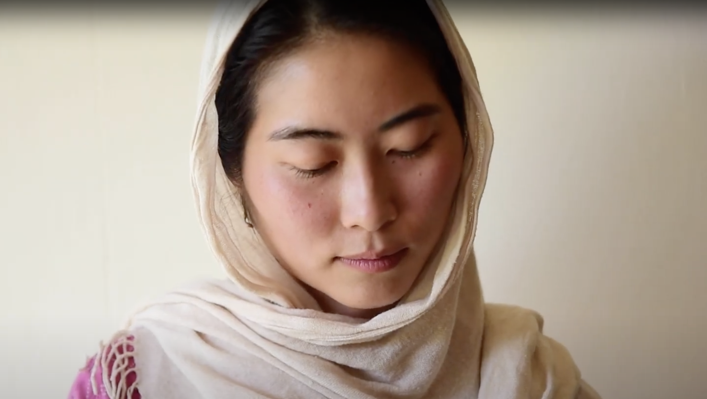
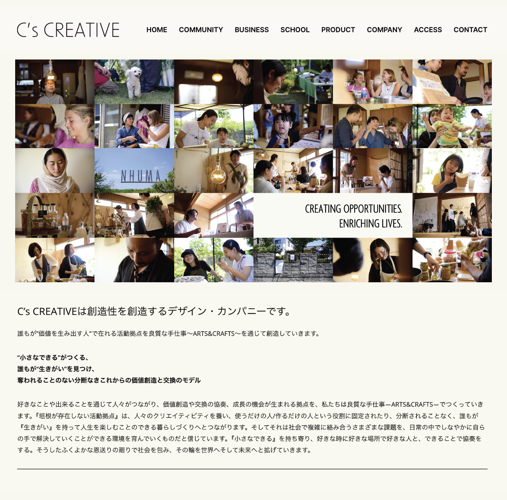
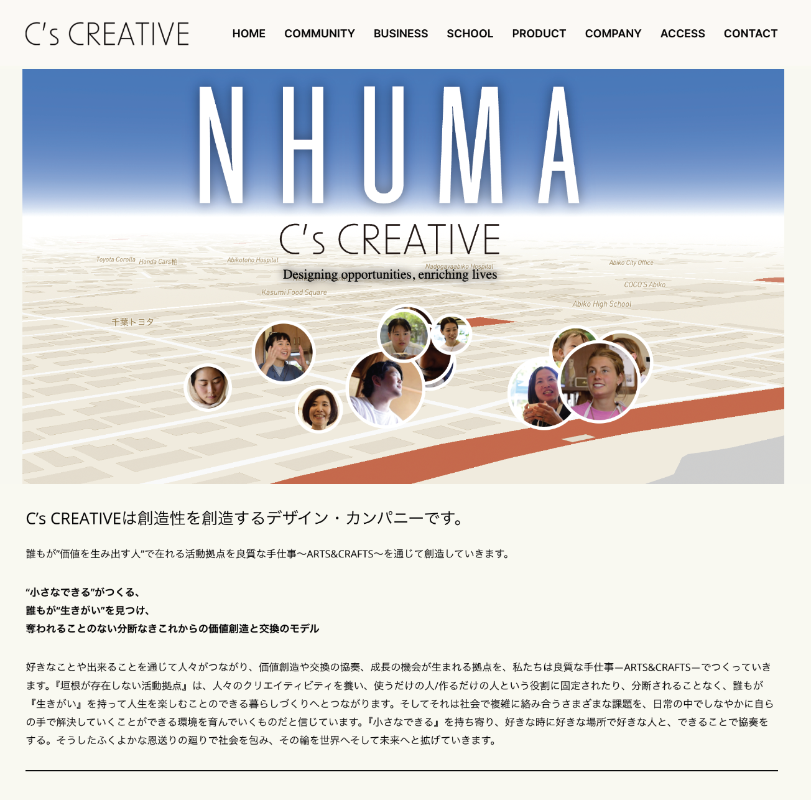

# NHUMA Idea Gallery

## Faces of NHUMA

[➡︎ Go to site](https://yohman.github.io/nhuma/web/)

This conceptual landing page for C's opens a world full of NHUMA people. It starts with a top down view of Teganuma, and slowly zooms in, revealing the faces of those touched by NHUMA's creative activities. The community of faces are scattered in an ecotone-a space that is situated between the end of the lake and the beginning of humanity-where lives are enriched and reborn. 

## NHUMA, the movie

[➡︎ Watch the short film](https://www.youtube.com/embed/75hCsplgKlU?si=dINbs--04GmX3RW1)

On June 15, 2024, a group of people from all walks of life joined together at NHUMA's Marce, enjoying a time of creative activities: crafting, exchanging, and sharing stories.

## Splash page concepts

### #1 NHUMA Faces

### #2 NHUMA Map

